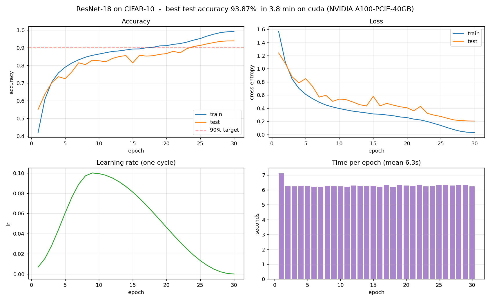
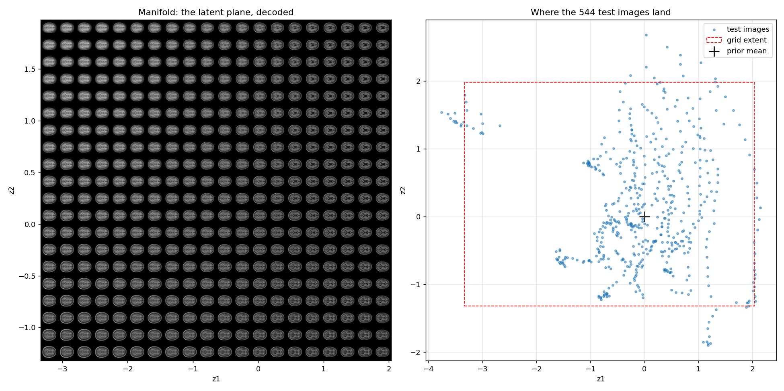
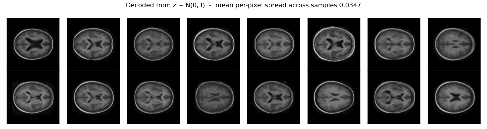
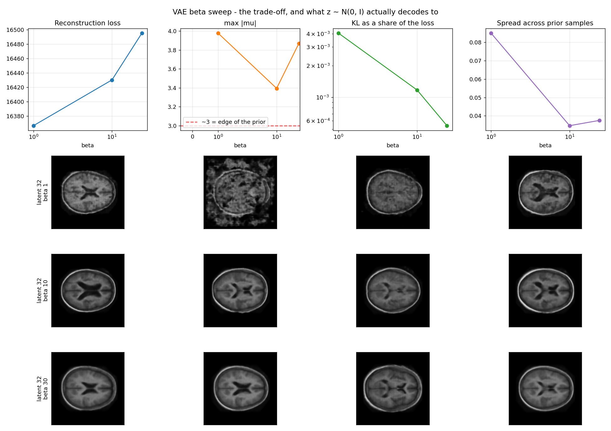
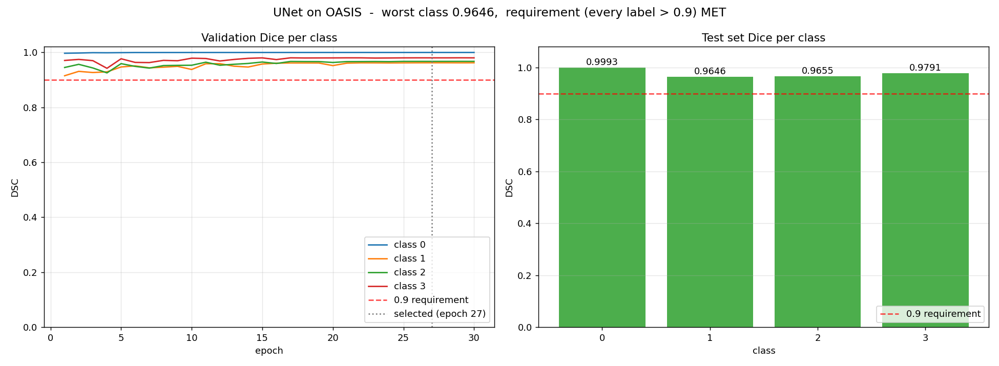
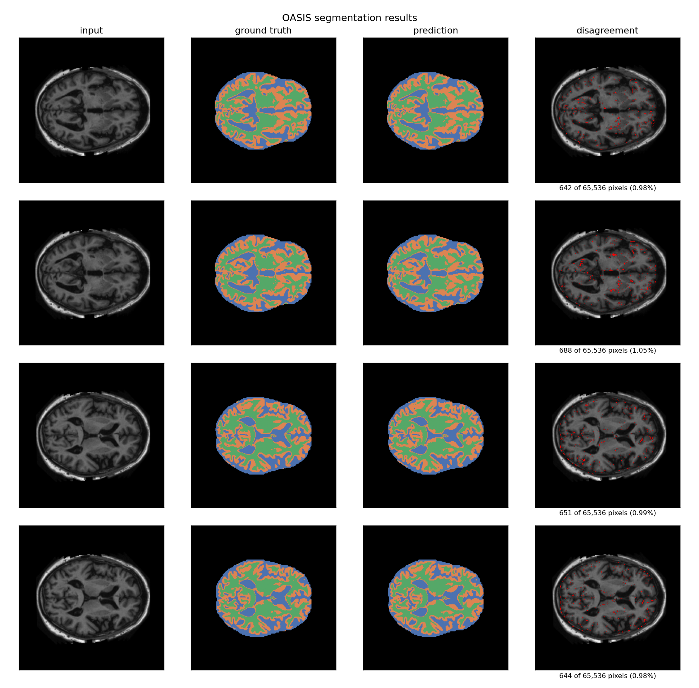
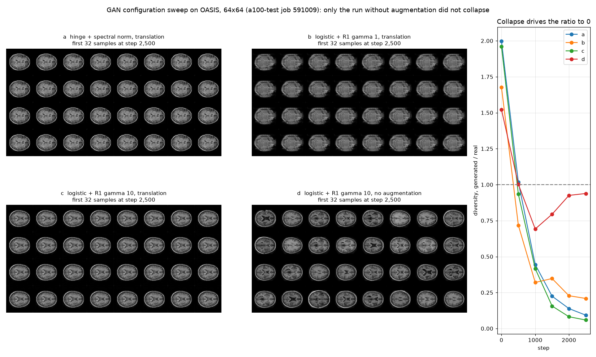

# COMP3710 Demonstration 2 - Rangpur work

Cluster code for COMP3710 Lab Demonstration 2 (Pattern Recognition), UQ
Semester 2 2026. Everything here runs on **Rangpur**, UQ's HPC cluster.

The notebook covering parts 1-3.1 lives in the course repository under
`demo2/`; this repository holds only the work that needs a GPU node.

| Part | Task | Marks | Status |
| --- | --- | ---: | --- |
| 3.2a | ResNet-18 on CIFAR-10, >90% test accuracy | 1 | **93.87% in 3.8 min - MET** |
| 3.2b | Inference + one training epoch live during the demo | 1 | rehearsed on Rangpur 14 Sep: 93.87% reproduced, epoch 9.0 s |
| 3.2c | Mixed precision, 94% at V100-360s or better | 2 | **94.31%** with test-time flip averaging (93.86% without), 209.7 s on an A100 - met, subject to the demonstrator accepting both |
| 4.4 Task 1 | OASIS VAE + manifold visualisation | (3/7 tier) | trained, beta swept, manifold rendered |
| 4.4 Task 2 | OASIS UNet, DSC > 0.9 all labels | (5/7 tier) | **worst class 0.9646 - MET**; live inference rehearsed 14 Sep, Dice reproduced |
| 4.4 Task 3 | OASIS GAN | (7/7 tier) | first configuration collapsed on OASIS; a sweep found one that draws varied brains; 128x128 and 256x256 runs queued |

## Results at a glance

Every figure below is committed in [`results/`](results/), beside the
`metrics.json` and per-epoch `history.csv` it was drawn from. The sections further
down explain how each was produced and what it shows.

### Part 3.2 - ResNet-18 on CIFAR-10

**93.87% test accuracy** after 30 epochs in 230.7 s on one A100, against a target
of 90% within thirty minutes. With mixed precision the same run reached 93.86% in
209.7 s, and **94.31%** when each test image is also classified mirrored.



More in [Results so far](#results-so-far).

### Part 4, Task 1 - a VAE of OASIS brain slices, and its manifold

The manifold of a two-dimensional latent space: every point of the plane decoded
into a brain (left), and where the 544 test images land in it (right).



Brains the 32-dimensional model invented, decoded from random draws of the prior:



At the default beta = 1 about a third of such samples were noise. The sweep that
diagnosed why, and chose beta = 10 for this model:



More in [What the sweep found](#what-the-sweep-found) and
[Task 1: the VAE](#task-1-the-vae).

### Part 4, Task 2 - UNet segmentation of OASIS

**Every class above the required 0.9 Dice** on the 544 test slices: 0.9993 for
background, then 0.9646, 0.9655 and 0.9791.



Input, ground truth, prediction, and the pixels where prediction and truth
disagree. On these slices about 1% of pixels disagree, mostly along the
boundaries between tissues.



More in [Task 2: the UNet](#task-2-the-unet). This inference is also run live
during the demonstration - see [Demonstration day](#demonstration-day).

## Layout

| File | Purpose |
| --- | --- |
| `resnet.py` | ResNet-18 written from scratch, with the CIFAR stem substitution |
| `data.py` | CIFAR-10 transforms, loaders, and device selection |
| `prepare_data.py` | One-off dataset download, to be run on a **CPU** node |
| `train.py` | Training loop, one-cycle schedule, checkpointing, metrics |
| `plot_run.py` | Turns a CIFAR run's `metrics.json` into curves and a summary |
| `plot_vae.py` | VAE figures: curves, reconstructions, samples, the manifold |
| `compare_vae.py` | Puts several VAE runs side by side, for the beta sweep |
| `plot_unet.py` | UNet figures: per-class Dice, curves, segmentation overlays |
| `demo_run.py` | The live demonstration script for 3.2b |
| `demo_unet.py` | The live UNet inference for Task 2, with a picture of chosen slices |
| `slurm/download.sh` | Fetch CIFAR-10 once, as a batch job on a CPU node |
| `slurm/smoke.sh` | Five batches on a GPU node - run this before any long job |
| `slurm/smoke_test_partition.sh` | The same check on `a100-test`, which usually starts sooner |
| `slurm/train.sh` | The full 30-epoch baseline run |
| `slurm/train_amp.sh` | The same run with mixed precision, for 3.2c |
| `slurm/demo.sh` | Batch fallback for the live 3.2 run |
| `slurm/demo_unet.sh` | Batch fallback for the live UNet inference, on the `cpu` partition |
| `tta_eval.py` | 3.2c: scores the mixed-precision checkpoint with test-time flip averaging |
| `slurm/tta.sh` | Runs that scoring on `a100-test` |
| `slurm/live.sh` | Runs a command under `srun` with the environment active, for the live demonstration |
| `oasis.py` | OASIS dataset: paths, mask pairing, label remapping |
| `vae.py` | The convolutional VAE |
| `train_vae.py` | Trains it and saves the manifold visualisation data |
| `slurm/smoke_vae.sh` | One epoch on 128 images, on `a100-test` |
| `slurm/train_vae.sh` | 30-epoch VAE run, 32-dimensional latent |
| `slurm/train_vae_latent2.sh` | The same with a 2D latent, for the decoded grid |
| `slurm/train_vae_beta.sh` | Beta sweep: `sbatch ... <latent_dim> <beta>` |
| `unet.py` | The UNet, the Dice loss and the per-class Dice metric |
| `train_unet.py` | Trains it and reports per-class DSC |
| `slurm/smoke_unet.sh` | One epoch on 128 slices, on `a100-test` |
| `slurm/train_unet.sh` | The 30-epoch UNet run |
| `gan.py` | Task 3: the generator, the spectrally normalised discriminator, hinge loss, weight averaging, DiffAugment |
| `train_gan.py` | Trains it, logging evidence as it goes; resumes across Slurm jobs |
| `evaluate_gan.py` | Measures novelty, diversity, coverage and anatomy against real slices, using the Task 1 VAEs and Task 2 UNet |
| `plot_gan.py` | Task 3 figures, drawn locally |
| `slurm/smoke_gan.sh` | On `a100-test`: resume, evaluation, and speed at 128 and 256 |
| `slurm/train_gan.sh` | A training run at one resolution: `sbatch ... <resolution> [steps]` |
| `slurm/evaluate_gan.sh` | Evaluates a finished run on `a100-test` |
| `slurm/sweep_gan.sh` | Four GAN configurations at 64x64 on `a100-test`, to find one that does not collapse |
| `slurm/gan128.args`, `slurm/gan256.args` | The configuration each long run reads when it starts |
| `explore_oasis.py` | Read-only probe of the OASIS dataset, before any Part 4 code |
| `slurm/explore_oasis.sh` | Runs that probe on a CPU node |

Checkpoints, datasets and Slurm logs are deliberately not tracked; see
`.gitignore`.

## results/

`runs/` is gitignored, because it holds 45 MB checkpoints and the dataset. But
that also hid the evidence, and a repository with no results in it does not show
that anything worked. `results/` therefore carries a curated copy of what the
runs produced:

| Per run | Contents |
| --- | --- |
| `metrics.json` | Arguments, device, timings and the full per-epoch history |
| `history.csv` | The same history as plain text, one row per epoch |
| Selected figures | The ones that are evidence for a claim, not every curve |

Checkpoints stay out. They are large, and inference for the demonstration runs
on the cluster where they already live.

Regenerate the figures from a run directory with `plot_run.py`, `plot_vae.py` or
`plot_unet.py`, and the sweep comparisons with `compare_vae.py`.

## Working arrangement

Code is edited and committed **locally**, then pulled onto the cluster. The
cluster only ever pulls, never pushes, which keeps the commit history clean and
avoids configuring GitHub credentials on a shared machine.

```
local machine:  edit -> git commit -> git push
Rangpur:        git pull -> sbatch -> results in logs/ and runs/
results back:   scp
```

## What this cluster actually looks like

Confirmed with `sinfo` and `scontrol show node` on 8 Sep 2026. These facts are
what the Slurm scripts are shaped around:

| Fact | Consequence |
| --- | --- |
| `comp3710` holds the A100 nodes `a100-0` .. `a100-9` | one `--gres=gpu:1` per job |
| The partition sets `AllowAccounts=comp3710` | **every GPU job needs `--account=comp3710`** |
| Nodes report `CfgTRES=cpu=8,mem=1M` | **never pass `--mem`** - see below |
| 8 cores per node, usually in `mix` state | `--cpus-per-task=4`, not 8 |
| Home quota 17 GB (`/home/Student/s4913333`) | fine for CIFAR-10 and a few checkpoints |

**The account trap.** Jobs default to the personal account (`s4913333`), which
the `comp3710` partition does not accept. Without `--account=comp3710` the job
sits in `PENDING` with `Reason=PartitionConfig` and never starts - it is a
permissions mismatch, not a queue, so waiting does not help. The `cpu` partition
has no such restriction, which is why the download job ran without it.

**One GPU per node, and they are always taken.** Each `a100-*` node carries
exactly one A100 (`gpu:a100:1`) alongside 8 CPU cores. The cores are mostly idle
- a typical node shows 1 or 2 of 8 allocated - but the single GPU is held, often
by jobs from other partitions (`cosc3500`, `a100-grind`) that share the same
physical machines. So the GPU is the bottleneck and trimming `--cpus-per-task`
does nothing for queue time.

The practical consequence: a smoke test that needs seconds of compute can wait
hours behind half-hour training jobs. Use `slurm/smoke_test_partition.sh`, which
targets `a100-test` (`AllowAccounts=ALL`, nodes `a100-a` and `a100-b`) and
usually starts much sooner. It is not always free, though: its `test` QoS caps
a job at 20 minutes and one job per user, and its two GPUs can be reserved for
higher-priority partitions - a job there waited about 13 minutes on 14 September.
Keep real training on `comp3710`.

**A queue full of jobs that will never run.** `squeue -p comp3710` shows dozens
of old jobs stuck at `Reason=PartitionConfig` - other students who hit the same
missing-`--account` problem and never diagnosed it. They are not competing for
resources, so the real queue is much shorter than it looks.

**The `--mem` trap.** The nodes advertise 1 MB of memory, meaning this cluster
does not schedule on memory at all. A job asking for `--mem=16G` matches no node
and pends forever with *"Requested node configuration is not available"*. The
job scripts therefore carry no `--mem` directive, which is deliberate and should
not be "fixed".

Requesting all 8 cores would mean waiting for an entirely free node, and the
A100s are normally partly allocated. Four cores lets a job share one.

## Setup on Rangpur

The Miniconda and PyTorch install from `COMP3710-Rangpur.pdf` (week 2) was done
in August and does not need repeating. Verify it still works, then clone:

```bash
ssh s4913333@rangpur.compute.eait.uq.edu.au     # UQ VPN required off campus

source $HOME/miniconda3/bin/activate
conda activate torch
python -c "import torch, torchvision; print(torch.__version__, torchvision.__version__)"

git clone https://github.com/liquidtoy001/COMP3710Rangpurfordemo2.git
cd COMP3710Rangpurfordemo2
mkdir -p logs
```

Then download CIFAR-10 once (~170 MB), as a batch job on a CPU node:

```bash
sbatch slurm/download.sh
squeue --me
cat logs/download_*.out
```

Two deliberate choices here.

`prepare_data.py` is separate from `train.py` because a GPU job that downloads
is a GPU job holding an A100 idle on the network, and one that fails outright if
the download does.

The download is a **batch** job rather than an `srun --pty` session because an
interactive allocation's wall clock runs in real time whether or not you are
typing. Time spent reading, waiting on a slow first `import torch`, or simply
being distracted all counts against it. A 30 minute interactive session expired
part-way through this download on the first attempt and took the SSH connection
with it. Batch jobs do not care: submit and walk away.

Interactive sessions are still the right tool for debugging and for holding a
GPU before the demonstration - just not for anything that runs unattended.

## Running

Always smoke test before queueing a long job:

```bash
sbatch slurm/smoke.sh
squeue --me
cat logs/smoke_<jobid>.out
```

Five batches, a few seconds of compute. If that prints a best accuracy and
writes `runs/smoke/metrics.json`, the environment, data path, model and
checkpoint writing all work.

Then the real run:

```bash
sbatch slurm/train.sh
cat logs/train_<jobid>.out
```

30 epochs of ResNet-18 on CIFAR-10. Expect comfortably under the 30 minute
DAWNBench guideline on an A100; the job's 40 minute limit is headroom, not a
target. The result lands in `runs/baseline/best.pt` and `runs/baseline/metrics.json`.

## Training records

Training runs on the cluster as a script, not as a notebook, because `sbatch`
jobs are non-interactive: a job may sit in the queue for half an hour and then
run while the laptop that submitted it is closed. There is no kernel and nobody
watching. The notebook's job is to *read* these records afterwards and present
them.

Every run leaves four artefacts in its `--out-dir`:

| Artefact | Contents |
| --- | --- |
| `history.csv` | One row per epoch, **flushed as the run goes** |
| `metrics.json` | The same history plus the arguments, device and totals |
| `best.pt` | Weights from the best epoch (~45 MB, never committed) |
| `curves.png` | Accuracy, loss, learning rate and per-epoch time |

The Slurm job's own `logs/train_<jobid>.out` sits alongside them, carrying the
job ID, the node name, `nvidia-smi` output and the per-epoch lines with
timestamps. Follow a running job with:

```bash
tail -f logs/train_<jobid>.out
```

The job scripts set `PYTHONUNBUFFERED=1` so that works. Without it Python
block-buffers stdout when it is a file rather than a terminal, and a running job
looks hung because nothing reaches the log until the buffer fills.

A job is finished when it no longer appears in `squeue --me`. To check how it
ended:

```bash
sacct -j <jobid> --format=JobID,JobName,State,Elapsed,ExitCode
```

`COMPLETED` with `0:0` is success; `TIMEOUT` means the `--time` limit was too
short and `FAILED` means the script itself errored.

`history.csv` is written incrementally and flushed every epoch on purpose: if
the job hits its Slurm time limit or the node fails, the record up to that point
survives. A summary written only at the end would be lost.

Bringing the results back:

```bash
scp -r s4913333@rangpur.compute.eait.uq.edu.au:~/COMP3710Rangpurfordemo2/runs/baseline runs/
scp s4913333@rangpur.compute.eait.uq.edu.au:~/COMP3710Rangpurfordemo2/logs/train_12345.out logs/
python plot_run.py runs/baseline
```

`plot_run.py` also prints the numbers worth quoting: best accuracy, total
training time, mean time per epoch, the epoch at which the run crossed 90%, and
whether the under-30-minute guideline was met.

matplotlib is not needed on the cluster - `train.py` skips the figure with a
note if it is not installed, and `plot_run.py` regenerates it locally from
`metrics.json`. Install it there only if you want the figure produced in the
job itself:

```bash
pip install --no-cache-dir matplotlib
```

**What the demonstrator sees:** a real training log with a job ID and a node
name, timestamped per-epoch progress, and curves generated from it - evidence of
a run that actually happened on Rangpur, rather than cells re-executed on the
spot.

## Demonstration day

Two things have to happen live on the cluster, because the lab sheet says so.
Training was done beforehand and its evidence is committed in `results/`;
neither live script overwrites the checkpoint it loads, so both are safe to run
twice. Both were rehearsed end to end on 14 September 2026.

| Requirement | Live script | Loads | Runs on | Rehearsal |
| --- | --- | --- | --- | --- |
| Part 3.2, requirement 2: run inference and one epoch of training | `demo_run.py` | `runs/baseline/best.pt` | an A100 on `a100-test` | 93.87% reproduced; inference 9.8 s, one epoch 9.0 s |
| Part 4, Task 2: run inference on a test set and show the model working | `demo_unet.py` | `runs/unet/best.pt` | 4 cores on `cpu` | Dice reproduced to 4.3e-6; 2 min end to end |

### What the rehearsal changed

The first plan was to hold a GPU interactively before the demonstrator arrived.
The rehearsal showed that does not work, for three reasons measured on the day:

* **`a100-test` is not usually free.** It has two GPUs (`a100-a`, `a100-b`),
  and both can be reserved for jobs from higher-priority partitions. A job there
  waited about 13 minutes.
* **Its `test` QoS caps a job at 20 minutes** (`sacctmgr show qos`) and allows
  **one job per user** (`QOSMaxJobsPerUserLimit`). A 30-minute request is
  rejected outright with `QOSMaxWallDurationPerJobLimit`, so a GPU cannot be
  held for long in advance.
* **An interactive allocation starts its clock when it arrives, not when it is
  used.** That 13-minute wait ended while the terminal was not being watched, and
  the 10-minute allocation expired unused.

So each live run hands its command straight to `srun`, through
`slurm/live.sh`. The run starts the moment the allocation arrives, none of the
allocation is wasted, and the output still streams into the terminal. And Task
2's inference, which is forward passes only, runs on the `cpu` partition, which
allocated at once.

Never run either script on a login node. By mistake one rehearsal did: inference
crawled on the CPU, and the training epoch then failed with `BlockingIOError` in
`os.fork()`, because login nodes limit how many processes a user may start and
the data loader could not start its workers.

### Part 3.2: inference, then one epoch of training

From `~/COMP3710Rangpurfordemo2` on a login node, inside `tmux` so a dropped SSH
connection does not cancel the job. Submit it when the demonstration starts, and
show the notebook and GitHub while it queues:

```bash
srun --partition=a100-test --gres=gpu:1 --cpus-per-task=4 --time=00:10:00 bash slurm/live.sh python demo_run.py --checkpoint runs/baseline/best.pt --data-dir $HOME/data | tee logs/demo_day_cifar.log
```

It prints the job id and the node, so it is visibly running on the cluster; then
test accuracy with a per-class breakdown, then one epoch of training with its
time. In rehearsal (job 590170, `a100-b`):

| | |
| --- | --- |
| test accuracy | 93.87%, the recorded figure; test loss 0.2039 |
| inference, 10,000 images | 9.77 s, mostly starting the data loader's workers |
| one epoch, 390 batches | 9.04 s |
| test accuracy after that epoch | 92.60% |

**Why one more epoch lowers test accuracy.** Training ended on a one-cycle
schedule, whose learning rate falls to about 4e-7 by the last step. The demo
epoch uses a constant 0.01, some 25,000 times larger, with the optimiser's
momentum starting from zero. That step moves the weights out of the minimum the
annealing settled into, and one epoch is too short to settle again. It is not
underfitting: training accuracy for that epoch was 98.50%. The checkpoint on
disk is untouched, since the epoch trains a copy in memory.

If `a100-test` is still queueing when the demonstration reaches this point,
check the estimated start with `squeue --me --start`, or show the batch run below.

### Task 2: UNet inference on the test split

```bash
srun --partition=cpu --cpus-per-task=4 --time=00:10:00 bash slurm/live.sh python demo_unet.py --device cpu --slices 12 200 431 | tee logs/demo_day_unet.log
```

Replace `12 200 431` with slices the demonstrator chooses, or use `--random 4`,
which prints its seed. Leaving both out draws four slices spread evenly across
the split.

It runs over all 544 test slices and prints each class's Dice coefficient
against the 0.9 requirement, beside the figures the training run recorded -
the same ones committed in `results/unet/metrics.json`. A live run that
reproduces them is the evidence that the committed results are real. In
rehearsal (job 590127, `vcpu-2`) inference took 85.3 s, and the largest
difference from the committed figures was 4.3e-6, which is floating-point
difference between CPU and GPU arithmetic.

It then draws the slices: input, ground truth, prediction, and the pixels where
prediction and truth disagree. The disagreeing pixels are scattered single
pixels along the boundaries between tissues, which is why Dice sits at 0.96-0.98
rather than 1. The picture is drawn with Pillow, because matplotlib is not
installed on Rangpur, and written to `runs/demo/`. The script prints the `scp`
command that copies it to the laptop. Create `runs/demo/` on the laptop first:
if the folder does not exist, `scp` writes the image to a file named `demo`.

### If the terminal is lost

A job started through `srun` inside `tmux` survives a dropped SSH connection:
reconnect and run `tmux attach -t demo`. If the session was opened on a
different login node, `ssh login0` first. The output is also in the `tee` log.

Without a terminal at all, both runs exist as batch jobs:

```bash
sbatch slurm/demo.sh                              # part 3.2, on comp3710
sbatch slurm/demo_unet.sh --slices 12 200 431     # Task 2, on cpu; arguments pass through
```

### Before the day

* **The demonstration is given from a MacBook, from a fresh clone.** SSH access,
  the UQ VPN and `~/.ssh/config` must all be verified on that machine, not only
  on the machine the code was written on.
* Check both checkpoints are still on the cluster: they are not in git.
* `git pull` on the cluster, so `slurm/live.sh` is there.

## Results so far

All measured on an A100-PCIE-40GB, 9 September 2026.

| Run | Result | Time |
| --- | --- | --- |
| 3.2a baseline | **93.87%** test accuracy - target met | 230.7 s |
| 3.2c mixed precision | 93.86% - unchanged within noise | 209.7 s (**9.1% faster**) |
| 3.2c, same weights, test-time flip | **94.31%** - 94% target met | no retraining |
| Task 1 VAE, latent 32 | best validation loss 16382 at epoch 14 | 181.7 s |
| Task 1 VAE, latent 2 | best validation loss 16885 at epoch 23 | 179.7 s |
| Task 2 UNet | **worst class DSC 0.9646** - every label above 0.9 | 17.7 min |

Three things in that table are worth being able to explain, because they are
what a demonstrator will ask about.

**Mixed precision bought only 9%.** Accuracy is unchanged, so nothing was lost
numerically - but a 9% speed-up is modest for half precision. ResNet-18 on
32x32 inputs is small enough that an A100 is never saturated: the bottleneck is
kernel launch overhead and the data loader, not arithmetic. That is the argument
for a larger batch size as the next 3.2c experiment, and it is why the DAWNBench
reference solutions raise batch size and use channels-last together with AMP
rather than relying on AMP alone.

**3.2c: 94.31% with test-time flip averaging, from the same mixed-precision
weights.** The AMP run's 93.86% was 14 of 10,000 test images below 94%.
`tta_eval.py` scores those weights with each image also classified mirrored left
to right, averaging the two softmax outputs. Nothing is retrained, so the
training time on record is unchanged. Job 590470, 15 September 2026; the output
is committed as `results/amp/tta.json` and `results/amp/tta_590470.txt` (the job's output, renamed
because `*.out` is ignored).

| | Test accuracy |
| --- | --- |
| AMP model, plain (reproduces the recorded figure) | 93.86% |
| AMP model, averaged with its horizontal flip | **94.31%** |

Every choice was fixed in the script before it was first run, because the test
set is to be scored once, not searched: the final-epoch AMP checkpoint (epoch 30,
so not one picked for its test score), a horizontal flip and nothing else,
softmax averaging, and full-precision evaluation. The plain score reproduced
93.86% exactly, so the change comes from the flip alone.

The gain is real rather than noise. One accuracy figure on 10,000 images has a
standard error of 0.23 points, but the right test compares the two scorings on
the same images: the flip corrected 112 predictions and broke 67. If it did
nothing, those 179 changes would split evenly; a split this lopsided has a
two-sided exact McNemar p of 0.001. The largest gains are for airplane (+1.2
points) and bird (+1.1), whose photographs face either way; ship is the only
class that lost (-0.4).

Two things no script settles, and both are for the demonstrator to judge: whether
flip averaging counts as part of the model, as it does in the fast DAWNBench
CIFAR-10 entries, and how an A100's 209.7 s (167.3 s of it training, the rest
per-epoch evaluation) compares with the lab sheet's 360 s on a V100.

```bash
sbatch slurm/tta.sh
```

**The 2-dimensional VAE scores within 3% of the 32-dimensional one, and the
reason is the opposite of what was expected.** Posterior collapse was the first
hypothesis; it is ruled out, because all 32 dimensions have a `mu` that varies.
The actual problem is too *little* regularisation, not too much.

At beta=1 the KL term is **0.43%** of the loss for the 32-dimensional latent and
**0.076%** for the 2-dimensional one. That is not a weighting, it is an absence:
reconstruction is summed over 65,536 pixels while KL is summed over a handful of
latent dimensions, so beta=1 does not put the two on comparable footing. The
model is trained as a plain autoencoder in all but name, which is exactly why
extra latent capacity buys so little.

Two consequences show up in the figures:

* Drawing `z ~ N(0, I)` lands in regions the encoder never visited, and about a
  third of `samples.png` is noise rather than brains. How it misses differs by
  latent size, which is worth stating precisely: the 2-dimensional run's codes
  simply run away, reaching `|mu| = 24` against a N(0, 1) prior. The
  32-dimensional run's reach only 3.98, so it is not a matter of distance -
  in 32 dimensions a draw from the prior sits near a shell of radius
  sqrt(32) = 5.7, while the encoder's codes average 0.80 per dimension and so
  fall well inside it. Same cause, different symptom: the KL term is too weak
  to shape the aggregate posterior into the prior.
* The manifold sweep was hard-coded to +/-2.5, which covered a small blob at the
  centre of a cloud spanning z1 in [-7, 25] - so every decoded tile looked
  identical. That was a plotting bug, now fixed: the grid is swept across the
  2nd-98th percentile of the codes the encoder actually produced, and the figure
  is labelled with those coordinates.

Making the KL about a tenth of the loss needs beta around 26 for the
32-dimensional latent and 147 for the 2-dimensional one. `slurm/train_vae_beta.sh`
brackets those:

```bash
sbatch slurm/train_vae_beta.sh 32 10
sbatch slurm/train_vae_beta.sh 32 30
sbatch slurm/train_vae_beta.sh 2 50
sbatch slurm/train_vae_beta.sh 2 150
```

### What the sweep found

| run | beta | recon | KL (nats) | b*KL/loss | max abs mu | prior samples |
| --- | ---: | ---: | ---: | ---: | ---: | --- |
| latent 32 | 1 | 16366.8 | 66.53 | 0.40% | 3.98 | some noise |
| latent 32 | **10** | 16430.3 | 19.33 | 1.16% | 3.39 | **all clean** |
| latent 32 | 30 | 16495.0 | 8.91 | 1.60% | 3.87 | clean, blurrier |
| latent 2 | 1 | 16899.6 | 10.85 | 0.06% | **24.33** | about a third noise |
| latent 2 | **50** | 16863.4 | 2.95 | 0.87% | 3.76 | **all clean** |
| latent 2 | 150 | 16914.2 | 1.15 | 1.01% | 3.87 | clean, blurrier |

**beta 10 at latent 32 and beta 50 at latent 2** are the settings to present. Both
give clean prior samples, and the reconstruction cost is 0.4% and *nothing* -
the latent-2 reconstruction actually improved slightly at beta 50. The expected
"blurry reconstructions for a well-behaved latent space" trade barely bites at
this scale, which is itself the finding.

The two latent sizes fail differently at beta=1, and saying so precisely matters.
At latent 2 the codes run away to `|mu| = 24` and the fix is visibly one of
distance: `max abs mu` falls to 3.76. At latent 32 the codes were never far -
3.98 at beta 1 - yet the samples were still noisy, and raising beta still fixed
them. There the mismatch is one of *shape*: a draw from N(0, I) in 32 dimensions
sits near a shell of radius sqrt(32) = 5.7, while the encoder's codes averaged
0.80 per dimension and fell well inside it. Beta reshapes the aggregate
posterior; it does not merely shrink it.

One reading trap, which the figures now label explicitly. The **raw KL falls** as
beta rises - that is exactly what beta asks for - while the KL's **share of the
optimised loss** (`beta*KL`) rises. Quoting one and calling it the other makes
the sweep look self-contradictory.

The sample-spread number is also not a diversity measure at low beta: 0.085 at
beta 1 versus 0.035 at beta 10 for latent 32. The larger figure is noise, not
variety. Only the decoded images settle that, which is why `compare_vae.py`
prints brains under the curves.

**The 30-epoch CIFAR baseline finished in under four minutes**, against a
DAWNBench guideline of thirty. The time requirement was never going to bind
here; the accuracy one is what mattered.

## Queueing work in parallel

GPU queue time on `comp3710` is measured in hours, so it is worth having every
job that is *ready* in the queue at once. Ready means the code exists and has
passed a smoke test - not that the task is on the list.

`slurm/train.sh` and `slurm/train_amp.sh` can both be queued now. They differ in
exactly one flag, `--amp`, with the same epochs, batch size, learning rate and
seed, so the difference in wall clock and final accuracy is attributable to
mixed precision alone. That is the first row of part 3.2c's ablation table.

What is *not* worth queueing is a speculative pile of variants. Each later
DAWNBench change - larger batch, channels-last, label smoothing, a retuned
one-cycle - needs its own controlled run, or the table cannot say which change
bought what.

Part 4's tasks cannot be queued yet, and the blocker is not the queue: nothing
can be written until the OASIS layout is known. That probe runs on an idle CPU
node in seconds, so it is the next thing to do, not something to wait for.

Parts 1, 2 and 3.1 need no cluster at all. LFW is about 1,300 images and trains
on a laptop.

## OASIS, as it actually is

Confirmed with `explore_oasis.py` on 9 September 2026:

```
/home/groups/comp3710/OASIS/
    keras_png_slices_train/          9,664 PNG   256x256 greyscale uint8
    keras_png_slices_validate/       1,120 PNG
    keras_png_slices_test/             544 PNG
    keras_png_slices_seg_{train,validate,test}/   matching masks, same counts
```

The split is already made, so no train/test division is done in code.

**Masks are stored as 0 / 85 / 170 / 255, not 0 / 1 / 2 / 3.** There are four
classes, spread across the 8-bit range so the masks are viewable as ordinary
greyscale PNGs. Feeding those raw values to cross entropy would treat them as
indices into a 256-class output - an index error at best, nonsense training at
worst. `oasis.encode_mask` maps them back, and raises if it meets a value
outside the known set rather than silently guessing.

**Image and mask filenames differ by their prefix**: `case_001_slice_0.nii.png`
pairs with `seg_001_slice_0.nii.png`. `oasis.mask_path_for` anchors that
substitution to the start of the name.

## Task 1: the VAE

`slurm/train_vae.sh` trains a 32-dimensional latent for 30 epochs;
`slurm/train_vae_latent2.sh` trains a 2-dimensional one. Both are worth having:
the first shows the model reconstructs faithfully, the second shows what the
latent space looks like without any dimensionality reduction in between.

Full marks need the manifold *visualised*, not just the model trained. Since
matplotlib is not on the cluster, `train_vae.py` saves what the figures need:

| File | Contents |
| --- | --- |
| `latents.npy` | `mu` for every test image - the manifold, before reduction |
| `reconstructions.npy` | Test images beside their rebuilds |
| `samples.npy` | Images decoded from `z ~ N(0, I)` - novel brains |
| `manifold_grid.npy` | A decoded sweep of the plane (2D latent runs only) |

Smoke test on `a100-test` before queueing a real run:

```bash
sbatch slurm/smoke_vae.sh
cat logs/vaesmoke_*.out
```

Use the script, not `sbatch --wrap`. A bare `--wrap` inherits Slurm's defaults -
one CPU and **no GPU** - so the first attempt at this ran on the CPU while
sitting on an A100 node, reported `device: cpu`, and validated everything except
the thing it existed to validate. Directives in a file cannot be forgotten.

`samples.npy` is the quickest read on whether training worked: a collapsed VAE
returns the same blurry average for every draw from the prior.

Two numerical details that are easy to get wrong and hard to debug afterwards:

* The reconstruction term is **summed** over pixels, not averaged. Averaging
  would shrink it by a factor of 65,536 against the KL term, and the model would
  collapse to emitting the dataset mean.
* `logvar` is clamped to [-10, 10]. The KL term contains `exp(logvar)`; left
  unbounded, a few bad early steps drove it to 1e12 in testing and took the run
  with it.

## Task 2: the UNet

The requirement is **DSC above 0.9 for every label**, with categorical
(one-hot) output. Four decisions follow from that wording and each should be
explainable on the day.

**Skip connections are the point.** Downsampling four times is what buys a large
receptive field, so a pixel's label can depend on distant context - but by the
bottleneck each position covers a 16x16 patch and precise boundaries are gone.
The decoder can recover *what* is present from the bottleneck but not exactly
*where* its edges are. The skips hand back the high-resolution encoder features
that place those edges to the pixel. For a per-pixel task that is the difference
between a usable mask and a blurry blob.

**Dice loss, not cross entropy alone.** Background dominates a brain slice, so a
model predicting background everywhere would score well on pixel accuracy and on
unweighted cross entropy while being useless. Dice normalises each class by its
own size, so a small structure counts as much as a large one. Cross entropy is
kept alongside it because it gives stronger gradients early, when predictions
are near-uniform and Dice's gradient is weak.

**The reported DSC uses the hard argmax; the loss uses soft probabilities.**
Argmax has zero gradient almost everywhere and cannot be trained through, so the
two necessarily differ - the training loss will always look slightly better than
the true coefficient. That is by design, not a bug.

**Dice is accumulated over the whole split, not averaged per batch.** Many
slices do not contain every class, and a per-slice Dice for an absent class is
0/0. Fudging that to either 0 or 1 distorts the average badly. Summing
intersections and cardinalities first and dividing once sidesteps it.

**The checkpoint is selected on the worst class, not the mean.** A mean is
easily carried over 0.9 by the background class while a tissue class languishes,
and the mean is not what is being marked.

```bash
sbatch slurm/smoke_unet.sh      # one epoch, 128 slices, on a100-test
sbatch slurm/train_unet.sh      # the real run
```

If a class falls short of 0.9, the levers in order are: more epochs; flip
augmentation; a wider network (`--base-channels 64`); and weighting the Dice
term towards the failing class. Change one at a time, or the ablation cannot say
what helped.

## Task 3: the GAN

The requirement is realistic brain generation with a GAN on OASIS, with evidence
of training. Full marks need results that "look like unique brains" with mode
collapse "fully resolved", and are judged by the demonstrator. Those two phrases
decide the design: most of the work is not the network but the evidence that its
output is realistic, new and varied.

**Status: the configuration that avoids mode collapse on OASIS is found, and the
128x128 and 256x256 runs are queued on Rangpur.** No full-length OASIS result yet.

### The model

The lab sheet warns that GANs converge chaotically, so every part of the model is
a standard, published remedy for instability, and `gan.py` says why at each one.
These parts are common to every run:

| Choice | Why |
| --- | --- |
| No BatchNorm in the discriminator | Its batches are all-real or all-fake, so batch statistics would leak which is which |
| Upsample then convolve in the generator | Transposed convolutions overlap unevenly and paint checkerboards on smooth tissue |
| Adam with beta1 = 0 | Momentum keeps pushing after the other network has moved, which feeds oscillation |
| An exponential moving average of the generator's weights, with BatchNorm statistics recomputed for it | The live weights jitter as the networks chase each other; the average draws steadier images |

How the discriminator is constrained and trained is what the first OASIS runs
changed.

### The first configuration collapsed, and what fixed it

The first configuration was the textbook stable one: hinge loss, spectral
normalisation on every discriminator layer, a discriminator learning rate four
times the generator's, and DiffAugment translation and cutout, so that 9,664
slices would not be memorised. Tested on synthetic slices it learnt them. On
OASIS (smoke test, job 590977) it collapsed: by step 300 the discriminator scored
real and generated slices alike at zero, and by step 1,000 all 64 progress samples
were the same brain.

`slurm/sweep_gan.sh` then compared four configurations at 64x64 for 2,500 steps
on a100-test (job 591009). Run a removes only cutout; b and c replace the whole
discriminator recipe (loss, penalty, learning rates); d removes augmentation from c:



| Run | Configuration | Diversity ratio at steps 0, 500 ... 2,500 | Result |
| --- | --- | --- | --- |
| a | hinge + spectral normalisation, translation only | 2.00 1.02 0.44 0.22 0.14 0.09 | collapsed |
| b | logistic loss + R1 penalty, gamma 1, no spectral normalisation, translation | 1.68 0.72 0.32 0.35 0.23 0.21 | collapsed |
| c | as b, gamma 10 | 1.96 0.93 0.42 0.16 0.08 0.06 | collapsed |
| d | as c, **no augmentation** | 1.52 1.00 0.69 0.79 0.93 0.94 | **varied brains** |

Removing cutout alone (a) did not help, and neither did replacing spectral
normalisation with an R1 penalty (b, c). Every run with augmentation collapsed;
the one without it recovered, and its samples are recognisably different brains -
different slice levels, ventricle shapes and sizes - after only 2,500 steps. So
the long runs use configuration d:

| Choice | Why |
| --- | --- |
| Non-saturating logistic loss | The generator's gradient is strongest exactly when the discriminator rejects its images, which is when it needs one |
| R1 gradient penalty on real images, gamma 10 (Mescheder et al., 2018) | Keeps the discriminator flat around the real data, so it cannot build a cliff that throws the generator's gradients around; it converges locally where unregularised GANs can orbit |
| No spectral normalisation, equal learning rates of 2e-4 | R1 already constrains the discriminator, and only where the data is |
| No augmentation | The sweep above |

What the sweep does not show: it did not include hinge with spectral
normalisation and no augmentation, so it shows that d works, not that R1 beats
spectral normalisation. Nor does it show why augmentation led to collapse here
when it did not on the synthetic slices; that stays an open question rather than
a claimed explanation.

The long runs read their configuration from `slurm/gan128.args` and
`slurm/gan256.args` when they start, so the sweep's answer could be applied to a
job already waiting in the comp3710 queue.

The generator maps 128-dimensional Gaussian noise through a 4x4 feature map and
successive doubling stages to 64x64, 128x128 or 256x256. 128x128 is the main
result and 256x256 the stretch, since a solid 128x128 result is worth more than a
failed 256x256 one.

No checkpoint is chosen by score. A GAN has no validation loss that says which
step is best, and choosing by eye would be choosing on the evidence, so a run
ends at its step count and its averaged generator is the result.

### The evidence, measured against real slices

`evaluate_gan.py` pairs every measurement on generated slices with the same
measurement on real test slices, which the GAN never saw:

| Question | Measurement | What failure looks like |
| --- | --- | --- |
| Copies of the training set? | Distance from each generated slice to its nearest training slice, against the same for test slices | Generated slices at near-zero distance from a training slice |
| Mode collapse? | Distance from each generated slice to its nearest other generated slice, against a random sample of training slices | Near-duplicates: distances far below the real ones |
| Realistic, and covering the variety of real brains? | Precision and recall against test slices (Kynkaanniemi et al., 2019) in the Task 1 VAE's 32-dimensional latent space; a scatter in the 2D VAE latent | Low precision: unrealistic slices. Low recall: only part of the variety of real brains |
| Plausible anatomy? | Tissue-class shares from the Task 2 UNet, and its confidence, against real slices | Brain-like texture with implausible proportions of tissue |

Every figure for generated slices is printed beside the same figure for a random
sample of real training slices, which is what a perfect generator of the training
distribution would produce, and so the level to aim at. An early version used
real validation slices for this and was wrong: those come from other people, and
scored below a small generator in testing.

The diversity check detects collapse and nothing else. In testing, a generator
trained for only 40 steps, whose output was noise, scored about 0.9 against real
slices' 1, because noise is varied too; its precision was 0. So realism is read
from precision and anatomy, and diversity only rules out collapse.

The VAE and UNet were trained here, on OASIS. FID, the usual GAN score, needs an
ImageNet-trained Inception network, a pre-trained model the lab sheet does not
allow without approval, so it is not used.

Two comparisons are made fair deliberately. Sets are compared at equal size,
because nearest-neighbour distances shrink as a set grows. And when the GAN works
below 256x256, real slices are downsampled and upsampled exactly as generated
ones are before the VAE and UNet see them, so the comparison is of content, not
resolution.

`plot_gan.py` draws the figures locally, including a quiz: eight real and eight
generated slices shuffled, with the answer key in a separate file.

### Local testing, before any cluster time

On 640 synthetic 256x256 "phantoms" in the OASIS layout (an elliptical skull,
a folded grey-matter band, white matter and ventricles, varying per case), a
64x64 run of 5,000 steps went from noise to recognisable phantoms by step 3,000,
and ended with a diversity ratio of 0.92, recall 0.55 against the reference's
0.94, tissue shares close to the reference's, and training and validation scores
that tracked each other throughout (no memorisation). Resuming from `last.pt`,
the SIGTERM and time-limit stops, evaluation from an unfinished run, and 128x128
and 256x256 training and evaluation were all exercised too. This shows the code
works and the measurements discriminate; it says nothing about OASIS.

### Running it

```bash
sbatch slurm/smoke_gan.sh               # a100-test: resume, evaluation, and speed at 128 and 256
sbatch slurm/sweep_gan.sh               # a100-test: which configuration avoids collapse
sbatch slurm/train_gan.sh 128           # comp3710, 3 h; resubmit the same line to continue
sbatch slurm/train_gan.sh 256
sbatch slurm/evaluate_gan.sh runs/gan128
```

`train_gan.py` writes its losses, discriminator scores and a diversity ratio as
it goes, plus a progress grid of the same 64 noise vectors every 1,000 steps. It
stops itself before the job's time limit, and on Slurm's SIGTERM, with `last.pt`
saved, so resubmitting continues the run.

The discriminator's score on validation slices, which it never trains on, is
logged beside its score on training slices. If the training score climbs away
from the validation score, the discriminator is memorising, which is the
overfitting DiffAugment is meant to prevent.

## Part 4: before writing any code

The three Part 4 tasks all read the preprocessed OASIS brain MR data from
`/home/groups/comp3710/`, but the lab sheet says nothing about how it is laid
out. The directory structure, file format, image size, image count, whether a
train/test split already exists and how many segmentation labels there are all
decide how the dataset class is written - so find out first rather than guess:

```bash
sbatch slurm/explore_oasis.sh
cat logs/oasis_*.out
```

It needs no GPU and no `--account`, so it runs on the idle `cpu` nodes
immediately instead of queueing behind the A100s. It is read-only.

The output should answer: where OASIS is and whether it is pre-split; the format
and image size (which fixes the VAE's input layer); whether label maps are
present and how many classes they contain (which fixes the width of the UNet's
one-hot output); and the total image count.

## Design notes

Points the code makes deliberately, and that should be explainable on the day:

* **The CIFAR stem.** torchvision's ImageNet ResNet-18 opens with a 7x7 stride-2
  convolution and a stride-2 max pool, sized for 224x224 inputs. On a 32x32
  CIFAR image that reduces the feature map to 8x8 before the first residual
  block runs. `resnet.py` uses a 3x3 stride-1 stem with no max pool instead, so
  the first stage still sees the image at full resolution.
* **The model is written out, not imported.** The lab sheet does not allow
  pre-built models without the demonstrator's approval.
* **Convolutions carry no bias**, because the BatchNorm that follows has its own
  learnable shift.
* **The shortcut is an identity wherever shapes allow**, and only projects with
  a 1x1 convolution when a block downsamples or changes channel count.
* **SGD with Nesterov momentum and a one-cycle schedule**, rather than Adam:
  higher final accuracy on CIFAR-10, and what the DAWNBench reference solutions
  use.
* **Timing calls `torch.cuda.synchronize()` first.** CUDA is asynchronous, so
  without it a measurement records how long it took to *queue* the work.
* **`--amp` exists but is off.** The baseline is measured in full precision;
  mixed precision is part 3.2c and should be reported as a delta against this.

## Sources and AI use

* Lab sheet: `COMP3710_Lab_2_2026_v2.01.pdf` (Shekhar Chandra, v2.01)
* Cluster guide: `COMP3710-Rangpur.pdf` (course material, week 2)
* Architecture: He et al., *Deep Residual Learning for Image Recognition*,
  CVPR 2016
* The CIFAR stem substitution and the one-cycle recipe are standard practice,
  widely documented in the DAWNBench reference solutions linked from the lab
  sheet's appendix B
* Claude (Anthropic) was used to draft this code; it was reviewed, smoke tested
  and is explainable by the author. A fuller AI usage record will be added as
  the work progresses.
